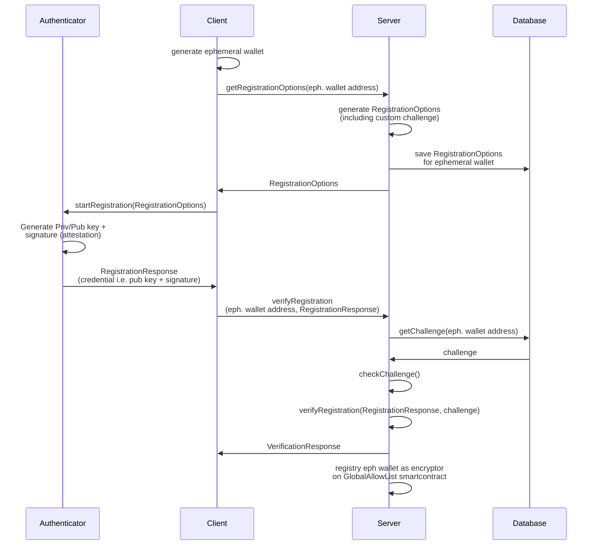

# SimpleWebAuthn Passkeys + TACo PoC

This is a Next.js app that implements passkeys using [SimpleWebAuthn](https://github.com/GoogleChromeLabs/simple-webauthn)
and [TACo](https://github.com/GoogleChromeLabs/taco).

The objective of this POC is to show how to use passkeys for TACo encryptor authentication.

## Usage

Recommended node version: v20.

```bash
npm install
# or
pnpm install
```

Create a new `.env` file with the environment variables required in `.env.template`
file.

```bash
npm run dev
# or
pnpm dev
```

[http://localhost:3000](http://localhost:3000)

## Diagrams

### Passkey registration flow



Note that, in the code, the code run by the server is in the `src/lib` directory,
while the code run by the client is in the `src/app` directory.
